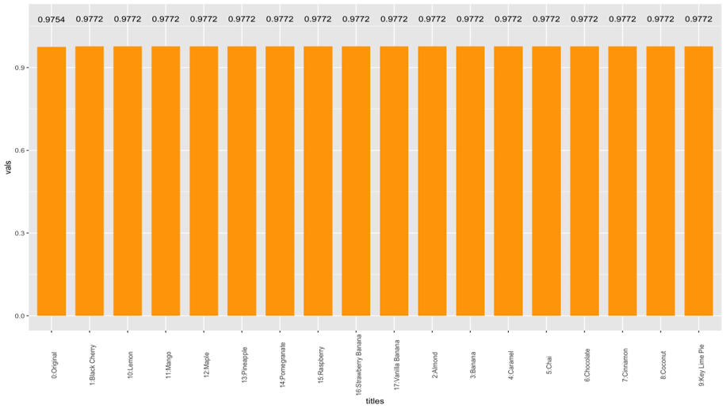

# Greek Yogurt Flavor Recommendation
Recommend the next flavor to launch with TURF Analysis

We are conducting analytics to provide input or recommendations to the
decision of which flavors to launch next. The private label we are working with recently
launched six flavors--Blueberry, Honey, Peach, Plain, Strawberry, and Vanilla.

We have access to the data from a survey that captures information about consumers’
flavor preferences. We also now have access to data pulled from the loyalty card system that the data architect created for the project through SQL Database.

## Overview
- Business Mandate: What is the next flavor to launch?
- Recommendation: Black Cherry 
- Reasons and analysis: 
  - High popularity in current Greek yogurt market
  - Relatively low competition in yogurt market
  - 4th preferred flavor according to survey
  - Highest reach in TURF analysis

## TURF Analysis

- Black cherry has the highest reach
